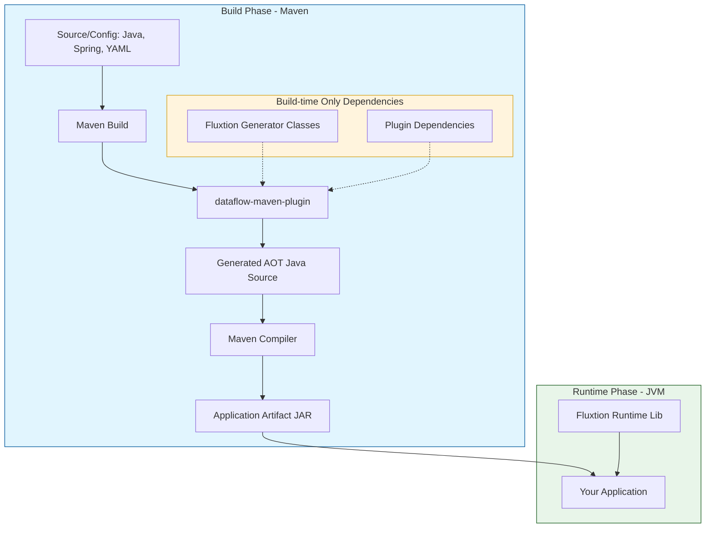

# dataflow-maven-plugin
A Maven plugin integrating the Fluxtion toolset with the Maven build cycle.

## Overview
Fluxtion is a high-performance, low-latency event processing engine. The `dataflow-maven-plugin` automates the generation of Fluxtion event processors from various sources (scanned classes, Spring contexts, or YAML configurations) during the Maven build lifecycle.

## Architecture and Execution Path

The following diagram illustrates how the `dataflow-maven-plugin` fits into the developer's execution path, highlighting the separation between build-time generation and runtime execution.



### Key Concepts

*   **Build-time Generation**: The `dataflow-maven-plugin` executes during the Maven `compile` phase. It processes your input configurations and generates optimized **Ahead-of-Time (AOT)** Java source code.
*   **AOT Source Usage**: The generated AOT source is automatically included in the compilation process. Your application code can then directly reference and use these generated classes for high-performance event processing.
*   **Separation of Concerns**: Fluxtion generator classes and plugin-specific dependencies are **only required during the build**. They do not need to be present on the runtime classpath, keeping your application artifact lean and minimizing runtime dependency conflicts.
*   **Runtime Requirements**: At runtime, your application only needs the core Fluxtion runtime library to execute the AOT-generated event processors.

## Repository Configuration
To use the `dataflow-maven-plugin`, you must include the following repository configuration in your client `pom.xml`:

```xml
<pluginRepositories>
    <pluginRepository>
        <id>repsy-fluxtion</id>
        <name>Fluxtion public maven repo on Repsy</name>
        <url>https://repo.repsy.io/mvn/fluxtion/fluxtion-public</url>
    </pluginRepository>
</pluginRepositories>
```

If the plugin's dependencies are also in the same repository, you may also need:

```xml
<repositories>
    <repository>
        <id>repsy-fluxtion</id>
        <name>Fluxtion public maven repo on Repsy</name>
        <url>https://repo.repsy.io/mvn/fluxtion/fluxtion-public</url>
    </repository>
</repositories>
```

## Usage

The plugin goals are bound to the `compile` phase by default. To trigger execution, you must define an `<execution>` block for the desired goal.

### Common Configuration
| Parameter | Description | Default |
|-----------|-------------|---------|
| `outputDirectory` | Path for generated Java sources. | `${project.build.sourceDirectory}` |
| `resourcesDirectory`| Path for generated resources. | `src/main/resources` |
| `-DskipFluxtion` | Command-line property to skip Fluxtion generation. | `false` |

### Goals

#### 1. `scan`
Scans compiled project classes for Fluxtion builder definitions and generates event processors.

```xml
<plugin>
    <groupId>com.fluxtion.dataflow</groupId>
    <artifactId>dataflow-maven-plugin</artifactId>
    <version>1.1-SNAPSHOT</version>
    <executions>
        <execution>
            <goals>
                <goal>scan</goal>
            </goals>
            <configuration>
                <buildDirectory>target/classes</buildDirectory>
            </configuration>
        </execution>
    </executions>
</plugin>
```
*   `buildDirectory`: Directory to scan for classes (default: `target/classes`).

#### 2. `springToFluxtion`
Generates a Fluxtion event processor from a Spring context definition.

```xml
<plugin>
    <groupId>com.fluxtion.dataflow</groupId>
    <artifactId>dataflow-maven-plugin</artifactId>
    <version>1.1-SNAPSHOT</version>
    <executions>
        <execution>
            <goals>
                <goal>springToFluxtion</goal>
            </goals>
            <configuration>
                <className>com.example.GeneratedProcessor</className>
                <packageName>com.example</packageName>
                <springFile>src/main/resources/spring.xml</springFile>
            </configuration>
        </execution>
    </executions>
</plugin>
```
*   `className`: (Required) Fully qualified name of the class to generate.
*   `packageName`: (Required) Package for the generated class.
*   `springFile`: (Required) Path to the Spring XML configuration.

#### 3. `yamlToFluxtion`
Generates event processors from YAML configuration files.

```xml
<plugin>
    <groupId>com.fluxtion.dataflow</groupId>
    <artifactId>dataflow-maven-plugin</artifactId>
    <version>1.1-SNAPSHOT</version>
    <executions>
        <execution>
            <goals>
                <goal>yamlToFluxtion</goal>
            </goals>
            <configuration>
                <fluxtionConfigFiles>
                    <file>src/main/resources/config.yaml</file>
                </fluxtionConfigFiles>
            </configuration>
        </execution>
    </executions>
</plugin>
```
*   `fluxtionConfigFiles`: (Required) Array of YAML configuration files to process.

## Skipping Execution
To temporarily disable the plugin during a build, use the `skipFluxtion` system property:

```bash
mvn compile -DskipFluxtion
```


